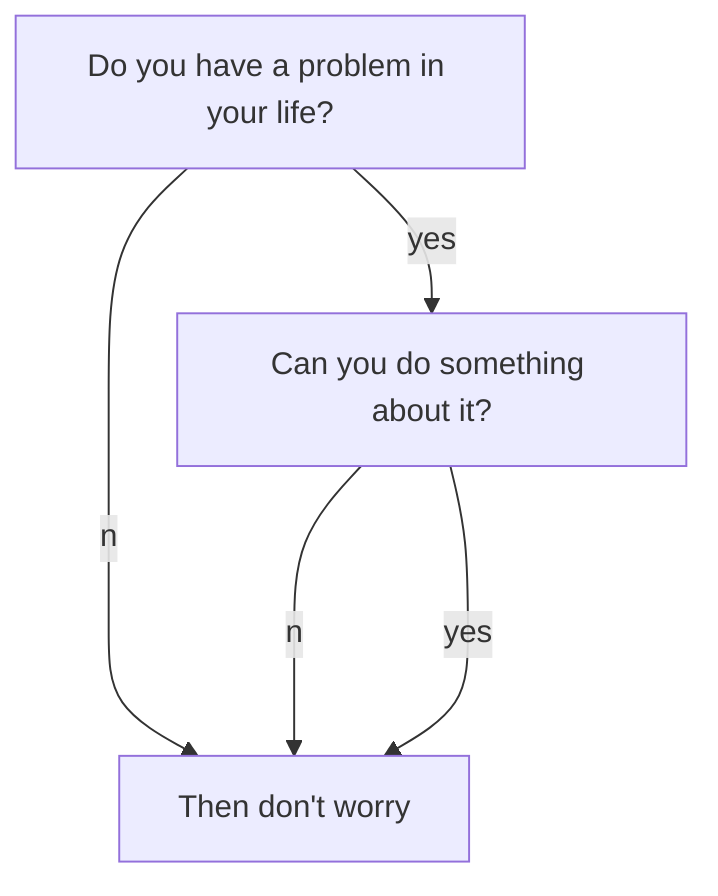

This is the notes about markdown style.

#### Math
`Preview:`

When $$a \ne 0$$, there are two solutions to $$ax^2 + bx + c = 0$$ and they are:
<div align="center">
    $$x_1 = {-b + \sqrt{b^2-4ac} \over 2a}$$
    $$x_2 = {-b - \sqrt{b^2-4ac} \over 2a} \notag$$
</div>

`Markdown:`

```md
When $$a \ne 0$$, there are two solutions to $$ax^2 + bx + c = 0$$ and they are:
<div align="center">
    $$x_1 = {-b + \sqrt{b^2-4ac} \over 2a}$$
    $$x_2 = {-b - \sqrt{b^2-4ac} \over 2a} \notag$$
</div>
```

